基于tf2组网实现各个网络。

### 数据说明

数据目录还是在code/data下。DIN、DIEN用`amazon-books-100k-preprocessed.csv`，其它模型用`criteo_sampled_data_OK.csv`。

> 数据处理部分只对缺失值做了下简单填充，主要目的是跑通所有组网。

`criteo_sampled_data_OK.csv`

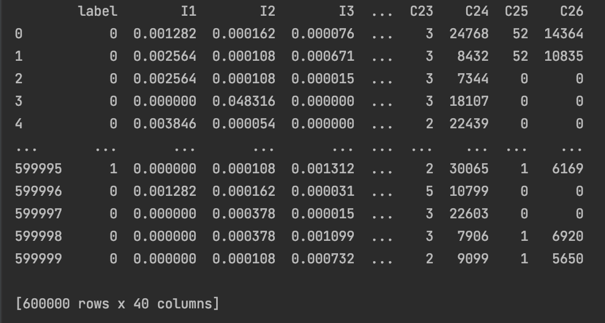

```
# dense_inputs: 数值特征，13维  I
# sparse_inputs： 类别特征，26维  C
```

`amazon-books-100k-preprocessed.csv`

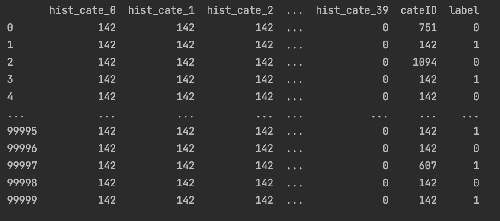

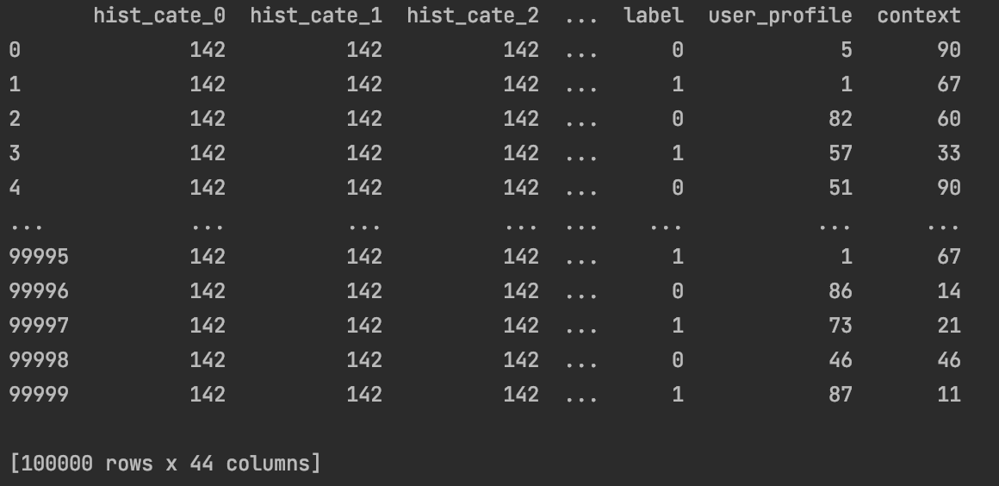

```
用户行为序列：hist_cate
目标广告id：cateID
新增两列假数据，模拟用户画像数据和上下文信息：user_profile、context
```


### 文件说明

+ src：各个组网代码存放位置，参数在`config.yaml`里。


### 训练-本地

以下为本地训练示例：

#### FM

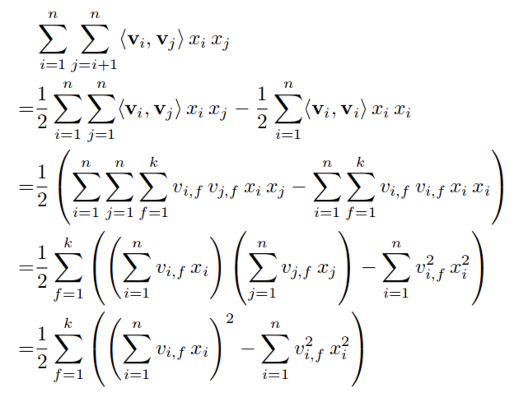

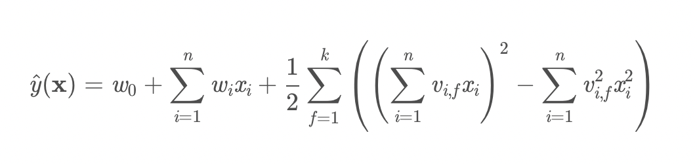

```
Epoch 1/3
422/422 [==============================] - 27s 65ms/step - loss: 0.5138 - auc: 0.7081 - precision: 0.5993 - recall: 0.1704 - val_loss: 0.4934 - val_auc: 0.7454 - val_precision: 0.6152 - val_recall: 0.2229
Epoch 2/3
422/422 [==============================] - 27s 64ms/step - loss: 0.4519 - auc: 0.7992 - precision: 0.6820 - recall: 0.3545 - val_loss: 0.4996 - val_auc: 0.7424 - val_precision: 0.5706 - val_recall: 0.3089
Epoch 3/3
422/422 [==============================] - 27s 64ms/step - loss: 0.4152 - auc: 0.8361 - precision: 0.7304 - recall: 0.4513 - val_loss: 0.5179 - val_auc: 0.7331 - val_precision: 0.5327 - val_recall: 0.3448
```


#### FNN

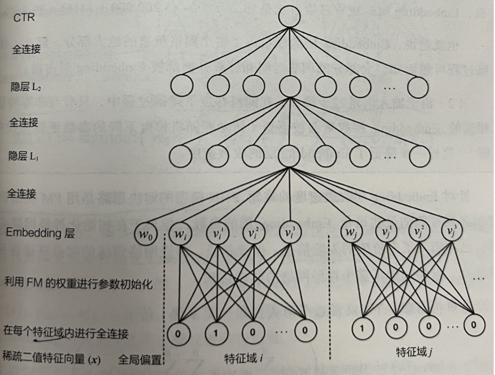

```
Epoch 1/3
216/216 [==============================] - 0s 2ms/step - loss: 2346847.0000 - auc: 0.5002 - precision: 0.2566 - recall: 0.2780
Epoch 2/3
216/216 [==============================] - 0s 2ms/step - loss: 175712.9844 - auc: 0.5054 - precision: 0.2640 - recall: 0.2782
Epoch 3/3
216/216 [==============================] - 0s 2ms/step - loss: 179549.7969 - auc: 0.5041 - precision: 0.2623 - recall: 0.2710
FM隐向量提取完成
Epoch 1/3
216/216 [==============================] - 4s 17ms/step - loss: 0.5714 - auc_1: 0.5523 - precision_1: 0.2538 - recall_1: 0.0149 - val_loss: 0.5682 - val_auc_1: 0.5561 - val_precision_1: 0.4211 - val_recall_1: 6.5009e-04
Epoch 2/3
216/216 [==============================] - 3s 16ms/step - loss: 0.5601 - auc_1: 0.5813 - precision_1: 0.5414 - recall_1: 6.5010e-04 - val_loss: 0.5622 - val_auc_1: 0.5736 - val_precision_1: 0.6571 - val_recall_1: 0.0019
Epoch 3/3
216/216 [==============================] - 3s 16ms/step - loss: 0.5585 - auc_1: 0.5894 - precision_1: 0.5833 - recall_1: 0.0015 - val_loss: 0.5612 - val_auc_1: 0.5808 - val_precision_1: 0.4896 - val_recall_1: 0.0038
FM Accuracy:  0.5665833333333333
FNN Accuracy:  0.743875
```


#### WDL

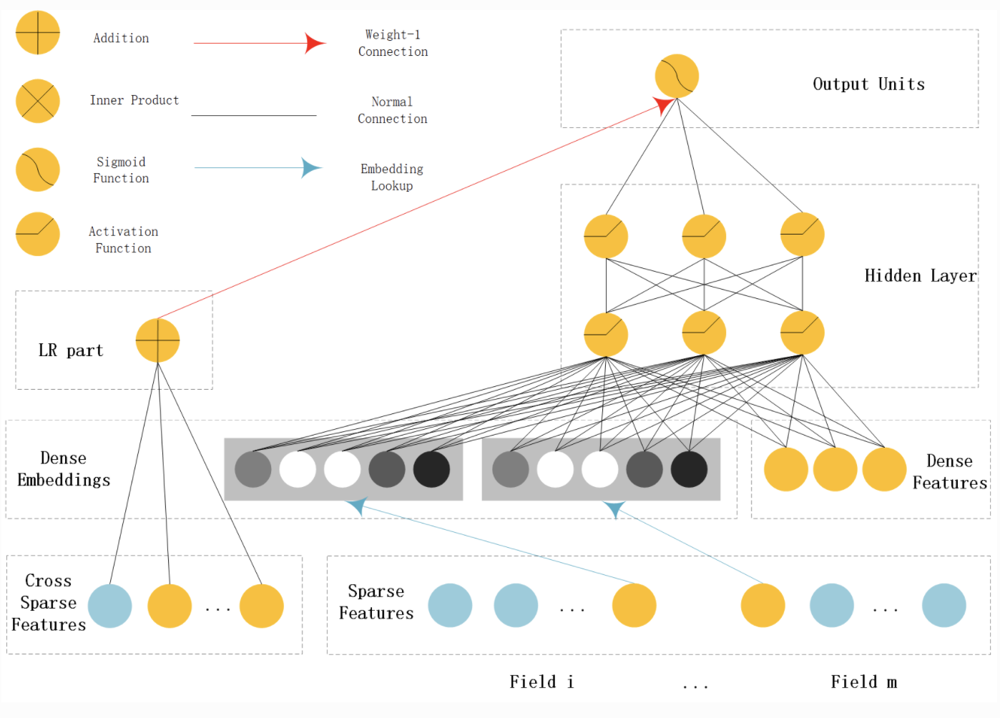

```
Epoch 1/3
215/216 [============================>.] - ETA: 0s - loss: 362.3944 - auc: 0.5093 - precision: 0.2697 - recall: 0.2706Tensor("wide_deep_net/concat_1:0", shape=(2000, 117), dtype=float32)
216/216 [==============================] - 8s 37ms/step - loss: 360.7360 - auc: 0.5095 - precision: 0.2699 - recall: 0.2699 - val_loss: 9.5656 - val_auc: 0.5045 - val_precision: 0.2571 - val_recall: 0.8003
Epoch 2/3
216/216 [==============================] - 8s 36ms/step - loss: 8.1209 - auc: 0.5805 - precision: 0.3577 - recall: 0.3609 - val_loss: 4.0739 - val_auc: 0.5357 - val_precision: 0.6106 - val_recall: 0.0254
Epoch 3/3
216/216 [==============================] - 8s 36ms/step - loss: 2.9503 - auc: 0.6771 - precision: 0.4734 - recall: 0.4667 - val_loss: 5.3457 - val_auc: 0.5337 - val_precision: 0.6819 - val_recall: 0.0340
```


#### DCN

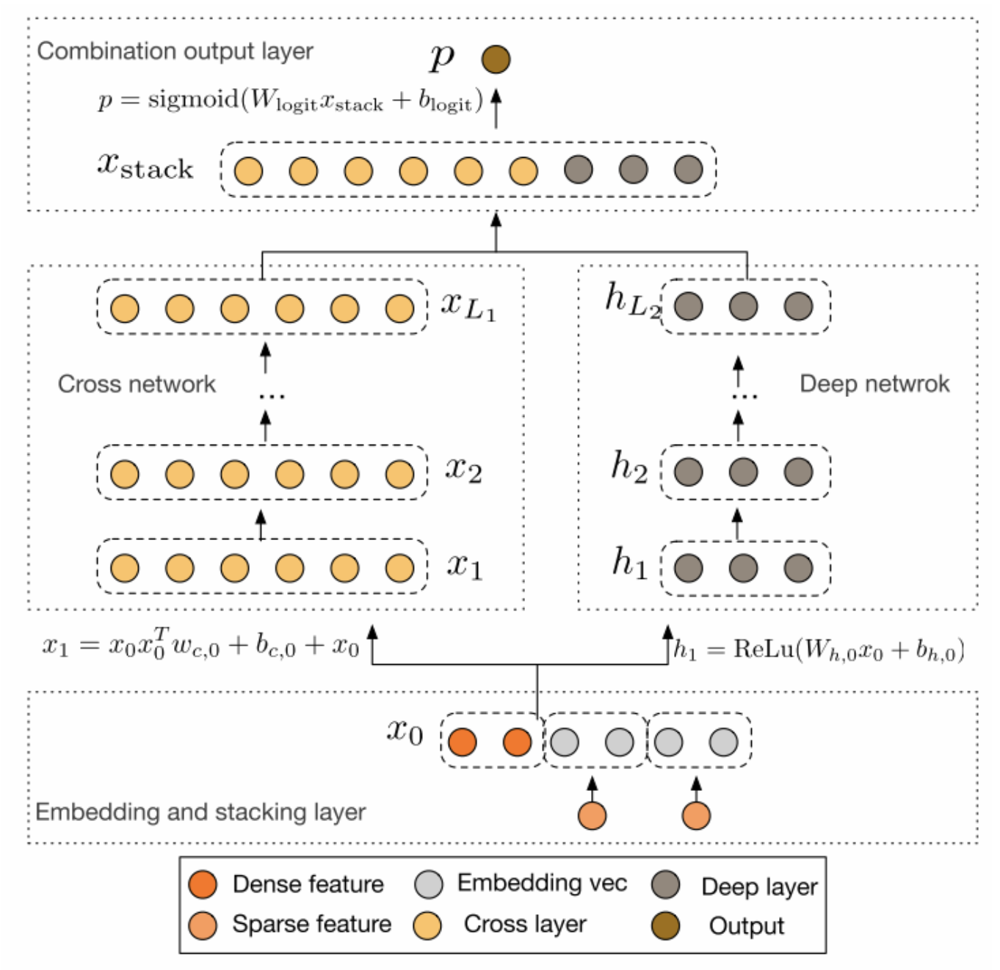

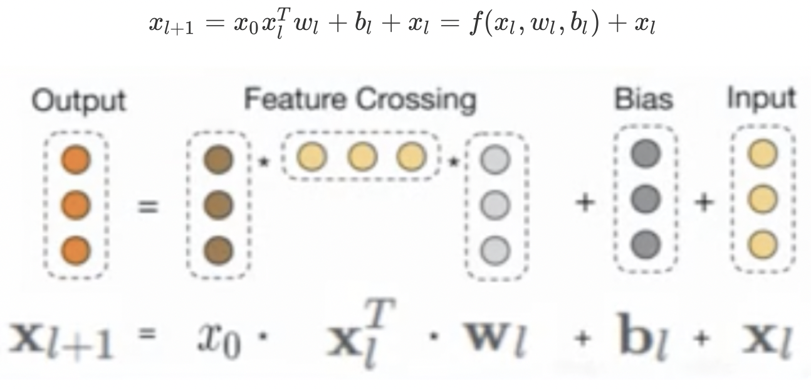

```
Epoch 1/3
216/216 [==============================] - 9s 42ms/step - loss: 0.5099 - auc: 0.7195 - precision: 0.5583 - recall: 0.2262 - val_loss: 0.5437 - val_auc: 0.7568 - val_precision: 0.0000e+00 - val_recall: 0.0000e+00
Epoch 2/3
216/216 [==============================] - 9s 41ms/step - loss: 0.4447 - auc: 0.8084 - precision: 0.6588 - recall: 0.3956 - val_loss: 0.5036 - val_auc: 0.7600 - val_precision: 0.7451 - val_recall: 0.0653
Epoch 3/3
216/216 [==============================] - 9s 40ms/step - loss: 0.3766 - auc: 0.8698 - precision: 0.7368 - recall: 0.5447 - val_loss: 0.5130 - val_auc: 0.7397 - val_precision: 0.5528 - val_recall: 0.3103
```


#### DeepFM


```
Epoch 1/3
216/216 [==============================] - 7s 32ms/step - loss: 0.5262 - auc: 0.6885 - precision: 0.6189 - recall: 0.0769 - val_loss: 0.4886 - val_auc: 0.7580 - val_precision: 0.6253 - val_recall: 0.2472
Epoch 2/3
216/216 [==============================] - 6s 30ms/step - loss: 0.4446 - auc: 0.8161 - precision: 0.6740 - recall: 0.4135 - val_loss: 0.5043 - val_auc: 0.7432 - val_precision: 0.5421 - val_recall: 0.3693
Epoch 3/3
216/216 [==============================] - 6s 30ms/step - loss: 0.3690 - auc: 0.8766 - precision: 0.7465 - recall: 0.5756 - val_loss: 0.5535 - val_auc: 0.7218 - val_precision: 0.4951 - val_recall: 0.4019
```


#### NFM

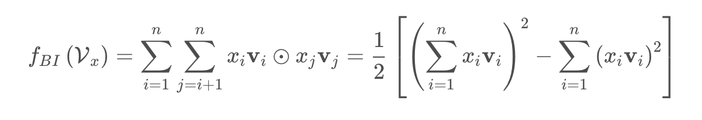

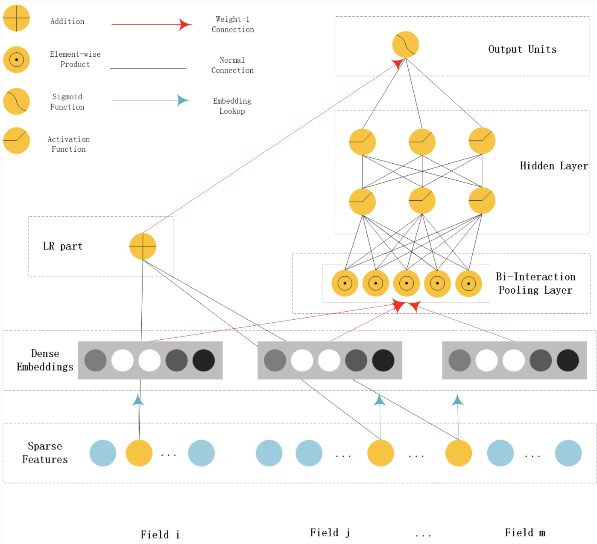

```
Epoch 1/3
216/216 [==============================] - 9s 40ms/step - loss: 303.4375 - auc: 0.5100 - precision: 0.2705 - recall: 0.2608 - val_loss: 6.0378 - val_auc: 0.5098 - val_precision: 0.3144 - val_recall: 0.0579
Epoch 2/3
216/216 [==============================] - 8s 38ms/step - loss: 6.3794 - auc: 0.5833 - precision: 0.3619 - recall: 0.3607 - val_loss: 1.0595 - val_auc: 0.6949 - val_precision: 0.4574 - val_recall: 0.4347
Epoch 3/3
216/216 [==============================] - 8s 39ms/step - loss: 3.1246 - auc: 0.6743 - precision: 0.4674 - recall: 0.4705 - val_loss: 2.2340 - val_auc: 0.6381 - val_precision: 0.6591 - val_recall: 0.1596
```

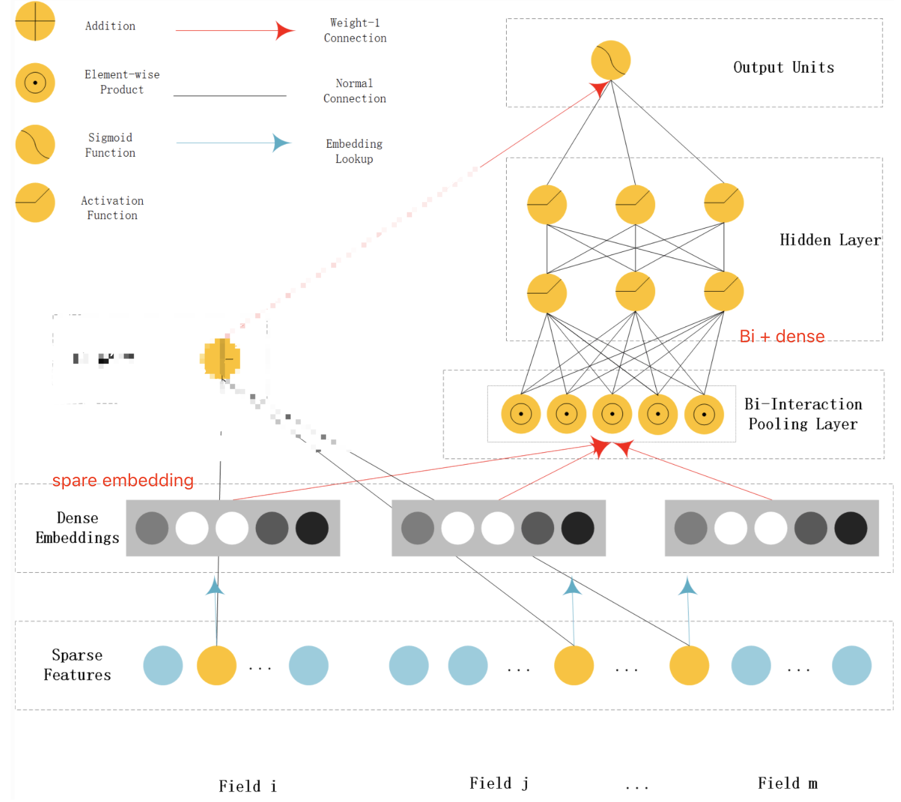

```
216/216 [==============================] - 9s 40ms/step - loss: 0.5199 - auc: 0.7063 - precision: 0.5384 - recall: 0.2012 - val_loss: 0.7697 - val_auc: 0.5373 - val_precision: 0.2555 - val_recall: 0.9365
Epoch 2/3
216/216 [==============================] - 8s 38ms/step - loss: 0.4435 - auc: 0.8099 - precision: 0.6554 - recall: 0.4039 - val_loss: 0.6465 - val_auc: 0.6146 - val_precision: 0.3263 - val_recall: 0.5390
Epoch 3/3
216/216 [==============================] - 8s 38ms/step - loss: 0.3665 - auc: 0.8787 - precision: 0.7301 - recall: 0.5816 - val_loss: 0.5173 - val_auc: 0.7295 - val_precision: 0.5086 - val_recall: 0.3723
```


#### AFM

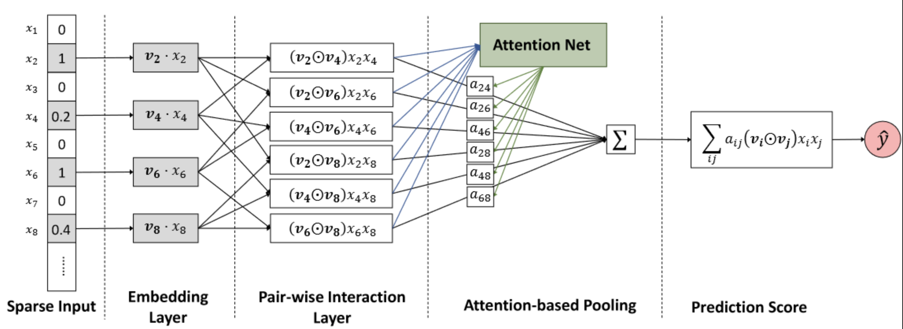

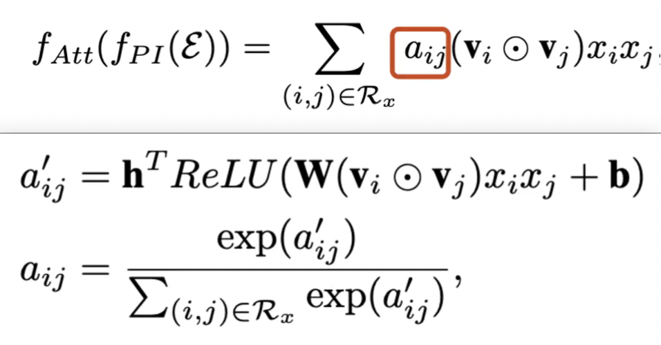

```
 19/216 [=>............................] - ETA: 3:34 - loss: 0.6862 - auc: 0.5224 - precision: 0.2786 - recall: 0.2134
```


#### DIN

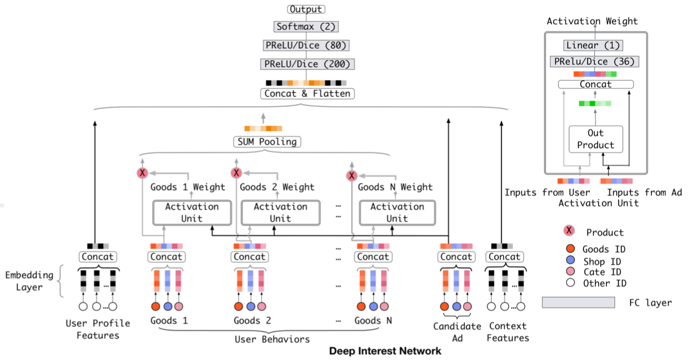

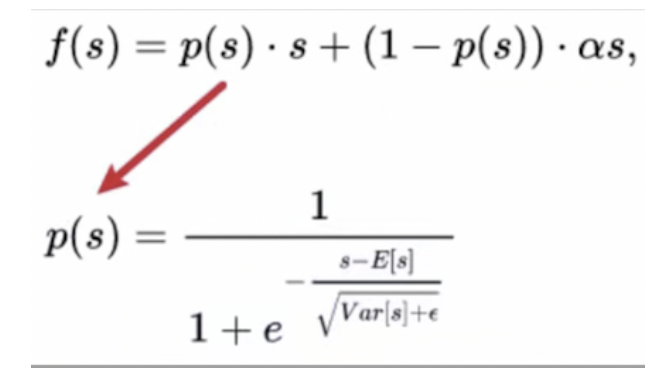

+ Activation Unit结构
  + 输入
    + 用户行为作为key；
    + 候选 item embedding，作为query；
  + Out Product层：
    - 计算矩阵之间的对应元素相乘；
  + Concat层：
    - 将 query、key、query-key、query、key(Out Product层，element-wise 乘法) 的结果进行拼接；
  + Dense层：
    - 全连接层，并以PRelu或Dice作为激活函数；
  + Linear层（输出层）：
    - 全连接层，输出单元为1，即得到（query, key）相应的权重值；

```
Epoch 1/3
36/36 [==============================] - 16s 438ms/step - loss: 0.6920 - auc: 0.5256 - precision: 0.5214 - recall: 0.4300 - val_loss: 0.6923 - val_auc: 0.5431 - val_precision: 0.5290 - val_recall: 0.2167
Epoch 2/3
36/36 [==============================] - 16s 431ms/step - loss: 0.6868 - auc: 0.5555 - precision: 0.5390 - recall: 0.4302 - val_loss: 0.6851 - val_auc: 0.5596 - val_precision: 0.5329 - val_recall: 0.7455
Epoch 3/3
36/36 [==============================] - 15s 429ms/step - loss: 0.6789 - auc: 0.5717 - precision: 0.5359 - recall: 0.6235 - val_loss: 0.6824 - val_auc: 0.5831 - val_precision: 0.5418 - val_recall: 0.7188
```


#### DIEN

相比于DIN， DIEN的改动：

+ 关注兴趣的演化过程，提出了兴趣进化网络，用序列模型做的， DIN中用户兴趣之间是相互独立的，但实际上的兴趣是不断进化的

+ 设计了一个兴趣抽取层，加入了一个二分类模型来辅助计算兴趣抽取的准确性

+ 用序列模型表达用户的兴趣动态变化性

实际的数据用例和DIN一样

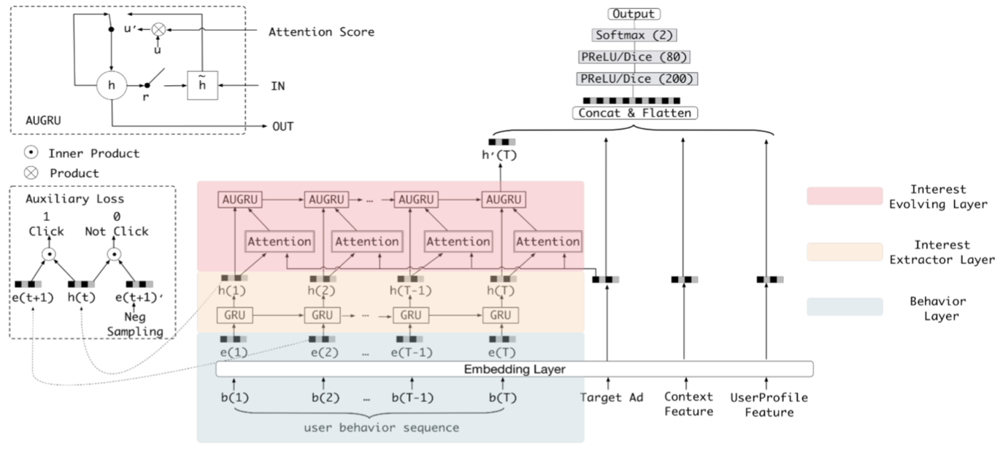

```
EPOCH : 0, train loss : 2.1815844, val loss: 0.6931561
EPOCH : 1, train loss : 1.776755, val loss: 0.69315314
EPOCH : 2, train loss : 1.1352692, val loss: 0.69314873
```


### 训练-GPU

#### dockerfile

```dockerfile
# # docker pull docker.mirrors.ustc.edu.cn/tensorflow/tensorflow:2.2.2-gpu-py3
FROM docker.mirrors.ustc.edu.cn/tensorflow/tensorflow:2.2.2-gpu-py3

RUN echo "" > /etc/apt/sources.list.d/cuda.list
RUN sed -i "s@/archive.ubuntu.com/@/mirrors.aliyun.com/@g" /etc/apt/sources.list
RUN sed -i "s@/security.ubuntu.com/@/mirrors.aliyun.com/@g" /etc/apt/sources.list
RUN apt-get update --fix-missing && apt-get install -y fontconfig --fix-missing
RUN apt-get install -y python3.7 python3-pip

RUN ln -sf /usr/share/zoneinfo/Asia/Shanghai /etc/localtime && echo "Asia/Shanghai" > /etc/timezone && \
    pip3 install -i https://pypi.tuna.tsinghua.edu.cn/simple numpy pandas sklearn scipy matplotlib seaborn h5py lightgbm xgboost && \
    pip install imbalance-xgboost

RUN pip3 install keras==2.4.3 -i http://pypi.douban.com/simple --trusted-host pypi.douban.com
RUN pip3 install deepctr[gpu] -i http://pypi.douban.com/simple --trusted-host pypi.douban.com

WORKDIR /ad_ctr

# cd /data/wangguisen/ctr_note/base_on_tf2
# docker build -t ad_ctr:3.0 -f ./dk/Dockerfile .

# docker run --gpus '"device=1"' --rm -it --name ad_ctr ad_ctr:3.0 bash
```


#### run

`DCN`

```shell
docker run -d --gpus '"device=1"' \
    --rm -it --name ctr_deepctr_MLR \
    -v /data/wangguisen/ctr_note/base_on_deepctr:/ad_ctr/base_on_deepctr \
    -v /data/wangguisen/ctr_note/data:/ad_ctr/data \
    ad_ctr:2.0 \
    sh -c 'python3 -u /ad_ctr/base_on_deepctr/src/ctr_MLR.py 1>>/ad_ctr/base_on_deepctr/log/ctr_MLR.log 2>>/ad_ctr/base_on_deepctr/log/ctr_MLR.err'
```

```
Epoch 1/10
216/216 - 5s - loss: 0.5099 - auc: 0.7198 - precision: 0.5651 - recall: 0.2206 - val_loss: 0.5360 - val_auc: 0.7549 - val_precision: 0.0000e+00 - val_recall: 0.0000e+00
Epoch 2/10
216/216 - 4s - loss: 0.4452 - auc: 0.8076 - precision: 0.6626 - recall: 0.3905 - val_loss: 0.4943 - val_auc: 0.7582 - val_precision: 0.7072 - val_recall: 0.1413
Epoch 3/10
216/216 - 4s - loss: 0.3742 - auc: 0.8711 - precision: 0.7424 - recall: 0.5479 - val_loss: 0.5171 - val_auc: 0.7369 - val_precision: 0.5253 - val_recall: 0.3595
Epoch 4/10
216/216 - 4s - loss: 0.3145 - auc: 0.9105 - precision: 0.7950 - recall: 0.6282 - val_loss: 0.5999 - val_auc: 0.7166 - val_precision: 0.4813 - val_recall: 0.4046
Epoch 5/10
216/216 - 4s - loss: 0.2750 - auc: 0.9322 - precision: 0.8219 - recall: 0.6763 - val_loss: 0.6642 - val_auc: 0.7082 - val_precision: 0.4827 - val_recall: 0.4005
Epoch 6/10
216/216 - 4s - loss: 0.2476 - auc: 0.9454 - precision: 0.8403 - recall: 0.7117 - val_loss: 0.7699 - val_auc: 0.7015 - val_precision: 0.4538 - val_recall: 0.4512
Epoch 7/10
216/216 - 4s - loss: 0.2264 - auc: 0.9546 - precision: 0.8546 - recall: 0.7394 - val_loss: 0.8133 - val_auc: 0.6930 - val_precision: 0.4693 - val_recall: 0.4052
Epoch 8/10
216/216 - 4s - loss: 0.2100 - auc: 0.9610 - precision: 0.8664 - recall: 0.7579 - val_loss: 0.9237 - val_auc: 0.6897 - val_precision: 0.4482 - val_recall: 0.4516
Epoch 9/10
216/216 - 4s - loss: 0.1971 - auc: 0.9657 - precision: 0.8750 - recall: 0.7737 - val_loss: 0.9625 - val_auc: 0.6887 - val_precision: 0.4427 - val_recall: 0.4601
Epoch 10/10
216/216 - 4s - loss: 0.1864 - auc: 0.9694 - precision: 0.8830 - recall: 0.7880 - val_loss: 1.0296 - val_auc: 0.6864 - val_precision: 0.4688 - val_recall: 0.4079
```

`AFM`

```shell
docker run -d --gpus '"device=1"' \
    --rm -it --name ctr_tf_AFM \
    -v /data/wangguisen/ctr_note/base_on_tf2:/ad_ctr/base_on_tf2 \
    -v /data/wangguisen/ctr_note/data:/ad_ctr/data \
    ad_ctr:3.0 \
    sh -c 'python3 -u /ad_ctr/base_on_tf2/src/ctr_AFM.py 1>>/ad_ctr/base_on_tf2/log/ctr_AFM.log 2>>/ad_ctr/base_on_tf2/log/ctr_AFM.err'
```

```
Epoch 1/10
216/216 - 23s - loss: 0.5981 - auc: 0.5572 - precision: 0.4525 - recall: 0.0463 - val_loss: 0.5248 - val_auc: 0.6954 - val_precision: 0.6408 - val_recall: 0.1102
Epoch 2/10
216/216 - 20s - loss: 0.4914 - auc: 0.7492 - precision: 0.6668 - recall: 0.2238 - val_loss: 0.4985 - val_auc: 0.7387 - val_precision: 0.6062 - val_recall: 0.2247
Epoch 3/10
216/216 - 20s - loss: 0.4460 - auc: 0.8069 - precision: 0.7086 - recall: 0.3575 - val_loss: 0.4994 - val_auc: 0.7419 - val_precision: 0.5649 - val_recall: 0.2976
Epoch 4/10
216/216 - 20s - loss: 0.4094 - auc: 0.8427 - precision: 0.7433 - recall: 0.4465 - val_loss: 0.5116 - val_auc: 0.7351 - val_precision: 0.5413 - val_recall: 0.3202
Epoch 5/10
216/216 - 20s - loss: 0.3785 - auc: 0.8678 - precision: 0.7709 - recall: 0.5124 - val_loss: 0.5301 - val_auc: 0.7276 - val_precision: 0.5135 - val_recall: 0.3517
Epoch 6/10
216/216 - 20s - loss: 0.3532 - auc: 0.8856 - precision: 0.7883 - recall: 0.5576 - val_loss: 0.5504 - val_auc: 0.7199 - val_precision: 0.5032 - val_recall: 0.3587
Epoch 7/10
216/216 - 20s - loss: 0.3330 - auc: 0.8986 - precision: 0.8002 - recall: 0.5894 - val_loss: 0.5736 - val_auc: 0.7126 - val_precision: 0.4882 - val_recall: 0.3737
Epoch 8/10
216/216 - 20s - loss: 0.3172 - auc: 0.9082 - precision: 0.8080 - recall: 0.6094 - val_loss: 0.5918 - val_auc: 0.7072 - val_precision: 0.4896 - val_recall: 0.3565
Epoch 9/10
216/216 - 20s - loss: 0.3045 - auc: 0.9155 - precision: 0.8138 - recall: 0.6283 - val_loss: 0.6143 - val_auc: 0.7029 - val_precision: 0.4759 - val_recall: 0.3745
Epoch 10/10
216/216 - 20s - loss: 0.2943 - auc: 0.9212 - precision: 0.8191 - recall: 0.6428 - val_loss: 0.6325 - val_auc: 0.6998 - val_precision: 0.4718 - val_recall: 0.3714
```


`DIN`

```shell
docker run -d --gpus '"device=1"' \
    --rm -it --name ctr_tf_DIN \
    -v /data/wangguisen/ctr_note/base_on_tf2:/ad_ctr/base_on_tf2 \
    -v /data/wangguisen/ctr_note/data:/ad_ctr/data \
    ad_ctr:3.0 \
    sh -c 'python3 -u /ad_ctr/base_on_tf2/src/ctr_DIN.py 1>>/ad_ctr/base_on_tf2/log/ctr_DIN.log 2>>/ad_ctr/base_on_tf2/log/ctr_DIN.err'
```

```
Epoch 1/10
36/36 - 2s - loss: 0.6918 - auc: 0.5294 - precision: 0.5370 - recall: 0.2822 - val_loss: 0.6909 - val_auc: 0.5424 - val_precision: 0.5268 - val_recall: 0.5205
Epoch 2/10
36/36 - 1s - loss: 0.6874 - auc: 0.5540 - precision: 0.5327 - recall: 0.5466 - val_loss: 0.6875 - val_auc: 0.5451 - val_precision: 0.5238 - val_recall: 0.6460
Epoch 3/10
36/36 - 1s - loss: 0.6818 - auc: 0.5683 - precision: 0.5374 - recall: 0.6177 - val_loss: 0.6829 - val_auc: 0.5688 - val_precision: 0.5290 - val_recall: 0.7160
Epoch 4/10
36/36 - 1s - loss: 0.6743 - auc: 0.5921 - precision: 0.5535 - recall: 0.5974 - val_loss: 0.6826 - val_auc: 0.5864 - val_precision: 0.5480 - val_recall: 0.6018
Epoch 5/10
36/36 - 1s - loss: 0.6688 - auc: 0.6080 - precision: 0.5629 - recall: 0.6313 - val_loss: 0.6799 - val_auc: 0.5875 - val_precision: 0.5503 - val_recall: 0.6028
Epoch 6/10
36/36 - 1s - loss: 0.6653 - auc: 0.6156 - precision: 0.5681 - recall: 0.6188 - val_loss: 0.6801 - val_auc: 0.5915 - val_precision: 0.5535 - val_recall: 0.5978
Epoch 7/10
36/36 - 1s - loss: 0.6626 - auc: 0.6209 - precision: 0.5717 - recall: 0.6184 - val_loss: 0.6797 - val_auc: 0.5928 - val_precision: 0.5475 - val_recall: 0.7075
Epoch 8/10
36/36 - 1s - loss: 0.6601 - auc: 0.6263 - precision: 0.5709 - recall: 0.6448 - val_loss: 0.6816 - val_auc: 0.5897 - val_precision: 0.5541 - val_recall: 0.5932
Epoch 9/10
36/36 - 1s - loss: 0.6582 - auc: 0.6311 - precision: 0.5713 - recall: 0.6729 - val_loss: 0.6826 - val_auc: 0.5911 - val_precision: 0.5480 - val_recall: 0.6618
Epoch 10/10
36/36 - 1s - loss: 0.6557 - auc: 0.6347 - precision: 0.5761 - recall: 0.6516 - val_loss: 0.6850 - val_auc: 0.5913 - val_precision: 0.5570 - val_recall: 0.5640
```


